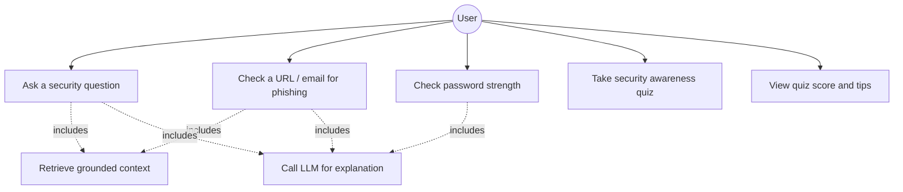
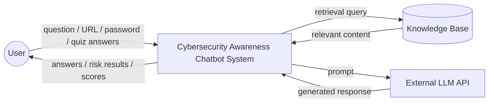
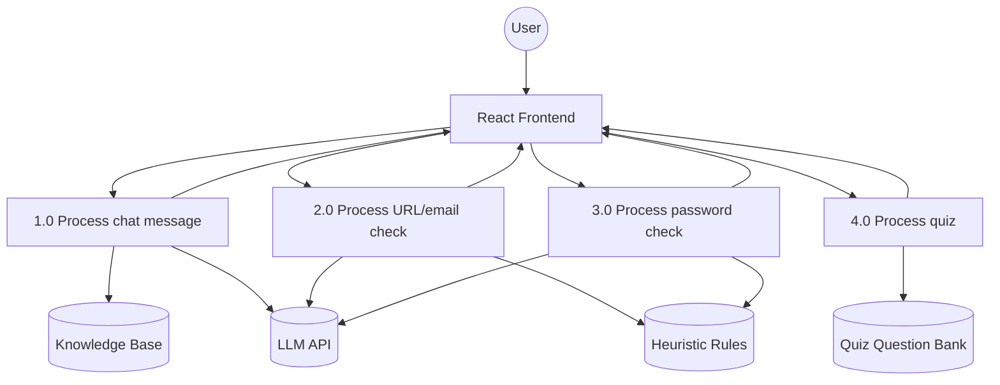
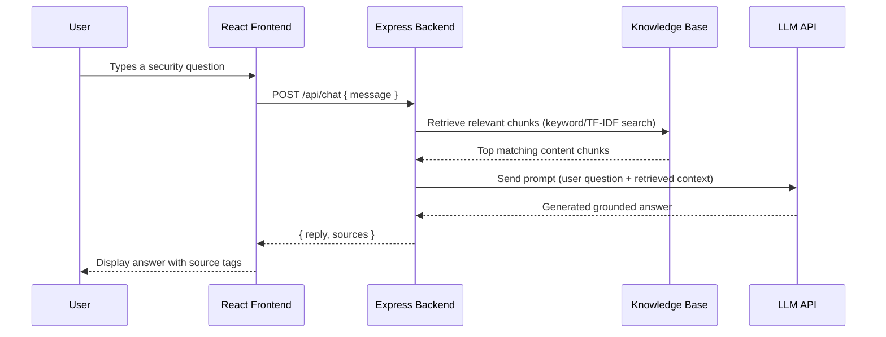
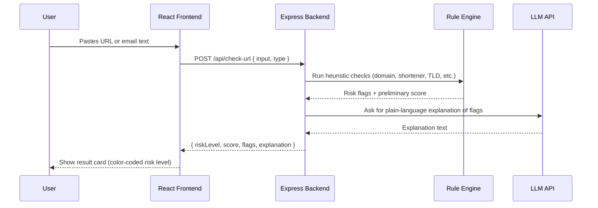
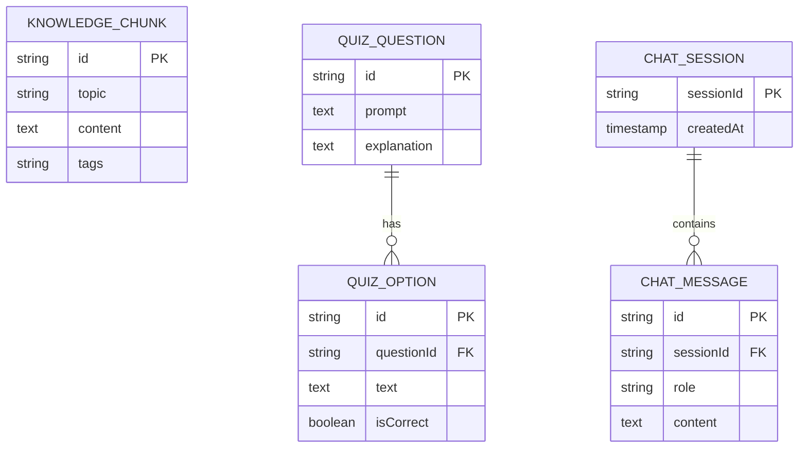
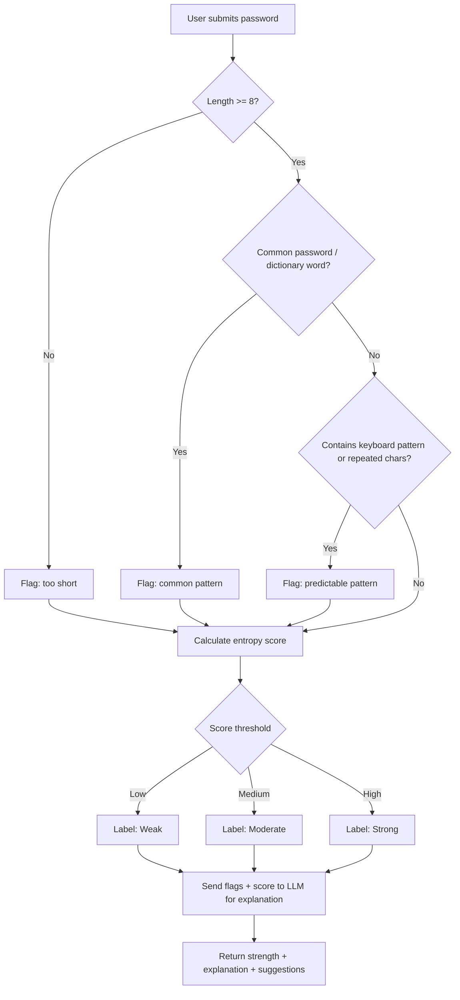

# Diagrams
## AI-Powered Cybersecurity Awareness Chatbot

All diagrams below use [Mermaid](https://mermaid.js.org/) syntax, which renders automatically in GitHub markdown previews. For the final report (usually a Word/PDF document), export each diagram as an image: paste the code into the [Mermaid Live Editor](https://mermaid.live), then export as PNG/SVG and embed it in the report.

---

## 1. Use Case Diagram

**Actors**: User (primary; no separate admin/system actor required for MVP scope).
**Use cases**: Ask a question, check a URL/email, check a password, take the quiz, view results.

---

## 2. Data Flow Diagram (DFD) — Level 0 (Context Diagram)

---

## 3. Data Flow Diagram (DFD) — Level 1

---

## 4. Sequence Diagram — Chat Request Flow

---

## 5. Sequence Diagram — URL/Phishing Check Flow

---

## 6. Entity-Relationship (ER) Diagram

The system is intentionally kept lightweight (no persistent user accounts for MVP), but the following entities model the knowledge base and quiz content that do exist as structured data.

> Note: `KNOWLEDGE_CHUNK` is the RAG grounding data (stored as flat files for MVP, modeled here as an entity for report completeness). `CHAT_SESSION`/`CHAT_MESSAGE` can be in-memory for MVP; the ER model shows the logical structure regardless of physical storage.

---

## 7. Flowchart — Password Strength Check Logic

